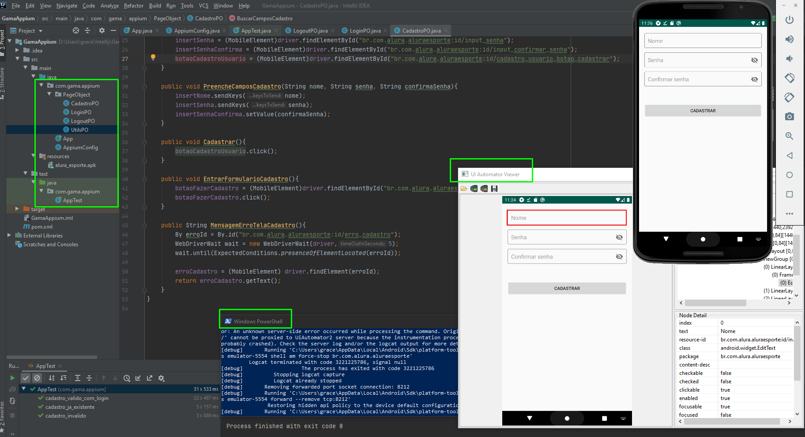

# Kratos_Appium_Tests

| Step    | Objetivo                                                                               | Check    |
| ------- | -------------------------------------------------------------------------------------   | --------|
|    1    | Automação com Appium [Projeto final GitHub](https://github.com/GraceTorresLeite/Kratos)   |   ✔    |

## Evidência - Appium 

* TERMINAL E EMULADOR INTELLIJ

#### Referência de pesquisas

[Smartbear](https://smartbear.com/blog/appium-tip-16-finding-elements-with-automation/)

[GitHub find elements](https://github.com/appium/python-client/issues/509)

[Appium.io](https://appium.io/docs/en/about-appium/api/)
